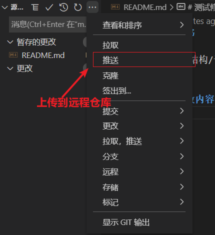

##### @1.调出全局搜索,方便改 bug

ctrl + f

enter 键向下一个位置跳转

esc 关闭.

##### @2.调出命令行

ctrl + p

##### @3.修改快捷方式的方法


3.全屏

F11

4.关闭侧边栏

ctrl B

5.关闭 fn 的情况下

home-end 跳转改行行首行位

6.跳转到对应匹配的括号位置


7.复制下一行

8.在上面插入新行


9.跳转到函数定义文件

按住 ctrl 点击函数名

看完之后

alt + 左方向键返回

##### @10.打开命令面板!!

```
win Ctrl+Shift+P
```


#### 2.重要的跳跃方法!!

##### @1.在{}括号外来回跳跃

```
Ctrl + Shift+\  前后来回跳跃
```

##### @2.光标回到底部和顶部

```
Ctrl + home/end
```

##### @3.光标回到该行最前和最后

```java
home / end
```

##### @4.回到上一次光标的位置,光标回退!!

```
Ctrl + U
```

有时候 vue 文件，你改了 html，需要去下面改 js，改完 js 又需要回去，这时候 Cmd+U 直接回

##### @5.选中光标移动的内容!!! 超级实用

```
按住shift键即可

```

##### @6.跳转到一个单词前面和后面!!! 好用

```
ctrl + 左右方向键
```

5 和 6 一起用就可以选中一个单词迅速删除/复制/剪切等

先方向键移动到单词首部,然后按住 shift,再方向键移动右键,就选中该单词内容了

```
注意!
action; 方向键从后面可以直接越过;到a ,从a开始却会在;前终止,可以放心使用
```

##### @7.选中单词!!

```
 Cmd+D
```

##### @8.删除/剪切一整行 好用

```
Ctrl+Shift+K

ctrl+x
```

##### @9.代码移动 当前代码移动到下一行!!

```
alt 上下方向键
```

##### @10.复制改行到下一行

```
alt shift 上下方向键
```

##### @11.多光标

```
按住alt 鼠标点击
```

##### @12.跳转到某一行

比如报错了你要调到 1000 行代码中的第 50 行,太麻烦了手动

```
ctrl g 输入行数回车
```


#### 3.代码重构

##### @1.批量修改函数中某个变量名字!!

#### 

##### @2.快速打开某个文件

```
 Ctrl+P 文件名
```


##### @3.快速关闭某个文件

```
ctrl w
```

##### @4.首字母大写/小写

```
ctrl shift l 小写
ctrl shift u 大写
```

```
History|2018_Book_GlobalHistoryAndNewPolycentric
```

#### 4.emmt 书写方式

##### @1.箭头函数

```
an + tab
```

#### 5.在 vscode 中操作 git

##### @1.在远程 github 仓库得到对应 http 链接


##### @2.在本地创建对应文件夹并克隆

```
这里可以使用小乌龟的克隆
点击后修改url即可
这样就初始化了git仓库
```


##### @3.vscode 保存文件到暂存区

修改本地文件内容后

```
点击+可以将文件保存到暂存区
git add .
```


##### @4.vscode 提交代码到本地仓库


##### @5.vscode 推送


